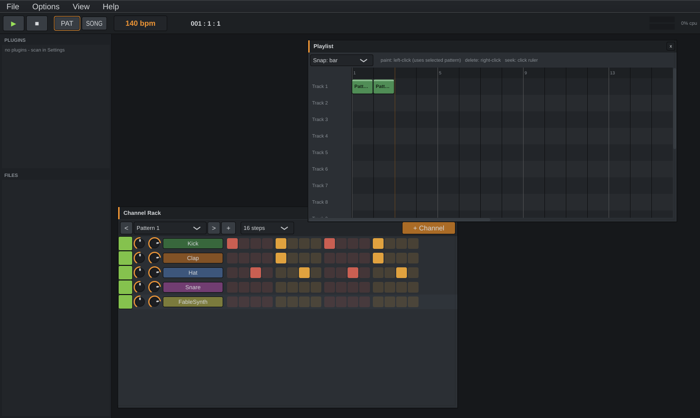

# FableStudio

An open-source, pattern-based digital audio workstation with **VST3 plugin support**,
built in C++20 on [JUCE 8](https://juce.com). The workflow follows the classic
pattern-DAW model: sketch beats in the **Channel Rack**, write melodies in the
**Piano Roll**, arrange patterns in the **Playlist**, and mix with effects in the
**Mixer**. All code and artwork are original.



## Features

- **Transport** — play/stop, PAT/SONG mode, draggable BPM, position readout, master meters, CPU display
- **Channel Rack** — per-channel mute LED, pan/volume knobs, mixer routing, and a
  16th-note step sequencer (16–128 steps per pattern), with fill/clear tools
- **Piano Roll** — draw, move, resize and delete notes with snap and zoom-to-key,
  velocity lane, keyboard preview column, live playhead
- **Playlist** — paint pattern clips onto 16 tracks, drag/resize/delete, bar ruler
  with click-to-seek, song loop
- **Mixer** — master + 16 insert tracks, faders, pan, mute/solo, peak meters, and
  **10 effect slots per track**
- **Built-in devices** — FableSynth (polyphonic subtractive synth), a pitched
  sampler (WAV/AIFF/FLAC/MP3/OGG), a DSP-synthesized drum kit (kick/clap/hat/
  openhat/snare — zero samples needed), and Fable Reverb / Delay / EQ3 / Limiter
- **VST3 hosting** — scans the platform default VST3 folders
  (`C:\Program Files\Common Files\VST3`, `/Library/Audio/Plug-Ins/VST3`,
  `~/.vst3`, `/usr/lib/vst3`, …) plus any folders you add, in the background with
  crash-skip protection; VST3 instruments load as channels, VST3 effects into
  mixer slots, each with its native editor window
- **Projects** — JSON-based `.fable` files including full plugin state; WAV export
- **Browser** — discovered plugins + a sample-file tree; double-click to add
- Keyboard shortcuts: `Space` play/stop, `F5` Playlist, `F6` Channel Rack,
  `F7` Piano Roll, `F9` Mixer, `L` PAT/SONG, `Ctrl+S/O/N`

## Download

Pre-built binaries for Windows, macOS and Linux are produced by the
[Build workflow](../../actions) — grab the artifact for your OS from the latest run.

## Building from source

Requirements: CMake ≥ 3.22, a C++20 compiler. JUCE is fetched automatically.

```sh
# Linux only: build dependencies first
sudo apt-get install -y ninja-build libasound2-dev libfreetype6-dev \
  libfontconfig1-dev libx11-dev libxcomposite-dev libxcursor-dev \
  libxext-dev libxinerama-dev libxrandr-dev libxrender-dev

cmake -B build -DCMAKE_BUILD_TYPE=Release
cmake --build build --config Release --parallel
```

The app lands in `build/FableStudio_artefacts/Release/`.

### Headless tool

`FableTool` (built alongside) runs the test-suite and renders projects offline:

```sh
FableTool test                       # unit tests
FableTool render song.fable out.wav  # offline render (song mode)
FableTool render-demo out.wav        # render the built-in demo groove
FableTool write-demo demo.fable      # write the demo project file
```

## First steps

1. Launch — the demo project plays with `Space` (PAT loops the pattern, SONG plays the playlist).
2. Click steps in the **Channel Rack** to change the beat; right-click a channel
   name for sample loading, routing and fill tools.
3. Open **Options → Audio & plugin settings → Plugins** and hit *Scan for VST3
   plugins* — your default VST3 folder is scanned automatically. Add instruments
   from **+ Channel** or the Browser.
4. Select a channel and press `F7` to write notes in the Piano Roll.
5. Paint the pattern into the **Playlist** (`F5`), switch the transport to
   **SONG**, and arrange.
6. **File → Export song to WAV** when it slaps.

## License

GPLv3 (JUCE is used under its AGPLv3/GPL-compatible open-source license).
FableStudio is an original work; it is not affiliated with or endorsed by
Image-Line, and contains no third-party DAW code or assets.
